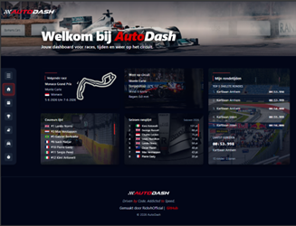
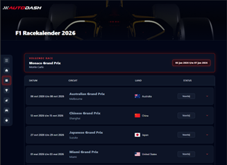
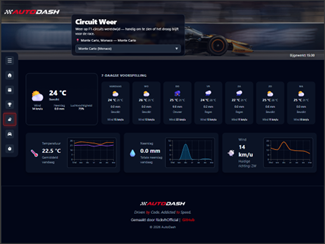
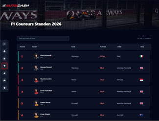
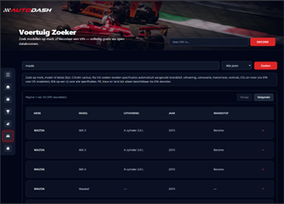
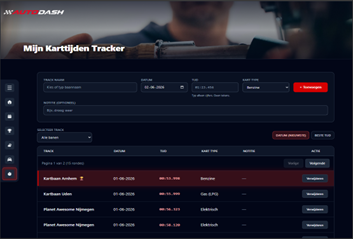

# AutoDash 🏎️

Een React-dashboard voor motorsport- en voertuigenthusiastelingen.

Tijdens mijn stage bij **Developing** heb ik AutoDash gebouwd: één plek voor Formule 1-data, weer op circuits, voertuigspecificaties en het bijhouden van mijn eigen karttijden. De app is responsive, heeft een licht/donker thema en werkt op desktop (sidebar) en mobiel (overlay-menu).

**Repository:** [github.com/RickvhOfficial/AutoDash](https://github.com/RickvhOfficial/AutoDash)

Het stage-projectplan met alle features en acceptatiecriteria staat apart in [PROJECTPLAN.md](./PROJECTPLAN.md).

---

## 📸 Screenshots

| Home & dashboard                      | F1-racekalender                               | Circuitweer                                  |
| ------------------------------------- | --------------------------------------------- | -------------------------------------------- |
|  |  |  |

| Coureursstanden                                  | Voertuigzoeker                                  | Karttijden tracker                             |
| ------------------------------------------------ | ----------------------------------------------- | ---------------------------------------------- |
|  |  |  |

---

## ✨ Features

- 🏁 **F1-racekalender** — alle races van het seizoen met circuit, datum en landenvlaggen
- 🏆 **Coureursstanden** — kampioenschap met nationaliteitsvlaggen per coureur
- 🌤️ **Circuitweer** — actueel weer en 7-daagse forecast per F1-circuit
- 🚗 **Voertuigzoeker** — zoeken op merk en model, resultaten in tabellen, VIN-decoder
- ⏱️ **Karttijden tracker** — eigen kart- en rondetijden bijhouden op elke baan die je wilt (vrije baannaam), met datum, karttype, notitie, filter per track, sorteren op datum of beste tijd, en verwijderen (localStorage)
- 🏠 **Home-dashboard** — volgende race, statistiekkaarten en wisselende motorsportfoto’s
- 🧭 **Navigatie** — inklapbare sidebar op desktop, hamburgermenu op mobiel
- ⚠️ **Loading & errors** — spinners en duidelijke foutmeldingen als een API niet bereikbaar is
- 🌓 **Thema** — schakelen tussen licht en donker

---

## 🛠️ Gebruikte technologieën

| Technologie                        | Gebruik in dit project                                        |
| ---------------------------------- | ------------------------------------------------------------- |
| **React 19**                 | UI en pagina’s                                               |
| **Vite 8**                   | Development-server en production build                        |
| **Tailwind CSS 3**           | Styling en responsive layout                                  |
| **React Router 7**           | Routing tussen pagina’s                                      |
| **Express 5**                | Backend: API’s aanroepen, cache, voertuig- en weer-endpoints |
| **Recharts**                 | Grafieken op de karttijd-pagina                               |
| **Font Awesome**             | Iconen in de interface                                        |
| **Vitest + Testing Library** | Unit- en componenttests                                       |
| **Axios / fetch**            | HTTP-requests naar eigen backend en externe API’s            |

In development stuurt Vite verkeer naar de Express-server op poort **8787** (`/api` en `/health`), zodat de frontend alles via hetzelfde domein ophaalt.

---

## 📡 APIs

Externe data komt grotendeels binnen via mijn Express-backend (`autodash/server/index.js`). Daar cache ik responses zodat OpenF1 en Open-Meteo niet bij elke pageload opnieuw worden aangeroepen. REST Countries roept de frontend zelf aan voor vlaggen op de racekaarten.

| API                                            | Doel                                              | Key nodig?                          |
| ---------------------------------------------- | ------------------------------------------------- | ----------------------------------- |
| [OpenF1](https://openf1.org/)                     | Racekalender, coureurs, standen, volgende race    | Nee                                 |
| [Open-Meteo](https://open-meteo.com/)             | Weerforecast en geocoding                         | Nee                                 |
| [REST Countries](https://restcountries.com/)      | Vlaggen en landinformatie bij races               | Nee                                 |
| [NHTSA vPIC](https://vpic.nhtsa.dot.gov/api/)     | Amerikaanse voertuigmerken en -modellen           | Nee                                 |
| [DB.VIN](https://db.vin/)                         | VIN-decoder (o.a. Europa)                         | Nee                                 |
| EPA fueleconomy.gov                            | Brandstof/verbruik voor VS-modellen (via backend) | Nee                                 |
| EU-catalogus (`autodash/data/car_data.json`) | Extra merken/modellen als fallback                | Nee                                 |
| [Unsplash](https://unsplash.com/developers)       | Achtergrondfoto’s op home en dashboard           | **Ja** (gratis developer key) |

Zonder Unsplash-key vallen de foto’s terug op placeholders in `autodash/public/placeholders/`.

**Eigen backend-endpoints (selectie):**

| Endpoint                        | Doel                                |
| ------------------------------- | ----------------------------------- |
| `GET /health`                 | Controleren of de backend draait    |
| `GET /api/dashboard-snapshot` | OpenF1 + weer voor home             |
| `GET /api/race-calendar`      | Volledige racekalender              |
| `GET /api/circuit-weather`    | Weer per circuitcoördinaat         |
| `GET /api/unsplash-hourly`    | Uurlijkse Unsplash-foto’s          |
| Voertuig-routes                 | Zoeken, VIN-decoder, merkverrijking |

---

## 🚀 Installatie

### Vereisten

- Node.js 20 of hoger (LTS aanbevolen)
- npm

### Project opzetten

```bash
git clone https://github.com/RickvhOfficial/AutoDash.git
cd AutoDash/autodash
npm install
```

Maak in de map `autodash` een bestand `.env.local` (dit bestand commit ik niet naar GitHub):

```env
VITE_UNSPLASH_ACCESS_KEY=jouw_unsplash_key_hier

# Optioneel — standaardwaarden werken ook zonder deze regels
VITE_UNSPLASH_API_URL=https://api.unsplash.com
VITE_OPENF1_URL=https://api.openf1.org/v1
VITE_OPEN_METEO_URL=https://api.open-meteo.com/v1/forecast
VITE_REST_COUNTRIES_URL=https://restcountries.com/v3.1
```

Je kunt `.env.example` kopiëren naar `.env.local` en alleen de Unsplash-key invullen.

### Development server starten

Voor de volledige app (aanbevolen):

```bash
npm run dev:all
```

Dit start tegelijk de React-app (Vite, poort 5173) en de Express-backend (poort 8787). Open daarna: [http://localhost:5173](http://localhost:5173)

Alleen frontend (zonder F1/weer/voertuigen via backend):

```bash
npm run dev
```

Alleen backend:

```bash
npm run dev:server
```

### Productie-build

```bash
npm run build
npm run preview
```

---

## 🧪 Tests uitvoeren

```bash
cd autodash
npm run test
```

| Script                    | Wat het doet                  |
| ------------------------- | ----------------------------- |
| `npm run test`          | Alle tests één keer draaien |
| `npm run test:watch`    | Tests in watch-modus          |
| `npm run test:coverage` | Coverage-rapport genereren    |
| `npm run lint`          | ESLint over de codebase       |

De tests dekken onder andere `lapStorage`, lap-tijdformattering en componenten zoals `Footer`, `LoadingSpinner` en `ErrorMessage`.

Uitgebreide testscenario’s:

- **Handmatig:** [TESTPLAN.md](./TESTPLAN.md)
- **Unit:** [TESTPLAN-UNIT.md](./TESTPLAN-UNIT.md)

---

## 📁 Projectstructuur

```
AutoDash/
├── README.md                 # Technische documentatie (dit bestand)
├── PROJECTPLAN.md            # Projectplan stage-opdracht
├── TESTPLAN.md               # Handmatig testplan
├── TESTPLAN-UNIT.md          # Unit-testplan
└── autodash/                 # React + Vite + Express applicatie
    ├── public/               # Logo, screenshots, placeholders, favicon
    ├── server/
    │   └── index.js          # Express backend (API’s, cache)
    ├── data/
    │   └── car_data.json     # Autocatalogus merken/modellen
    ├── scripts/              # Hulpscripts (o.a. responsive audit)
    └── src/
        ├── main.jsx          # Entry point React
        ├── App.jsx           # Router, layout, sidebar, routes
        ├── pages/            # Home, RaceCalendar, DriverStandings, CircuitWeather, ...
        ├── components/       # Header, Footer, RaceCard, WeatherCard, ...
        ├── hooks/            # useDashboardData, useF1Drivers, useLapTimes, useMediaQuery
        ├── services/         # dashboardService, weatherService, countriesService, ...
        ├── utils/            # lapStorage, themeClasses, ...
        ├── data/             # circuits, driver nationalities
        ├── constants/        # Layout-constanten
        ├── context/          # ThemeProvider (licht/donker)
        └── tests/            # Vitest tests
```

### Routes in de applicatie

| Route            | Pagina             | Beschrijving                                            |
| ---------------- | ------------------ | ------------------------------------------------------- |
| `/`            | Home               | Dashboard met volgende race en statistieken             |
| `/races`       | Racekalender       | Alle F1-races van het seizoen                           |
| `/standings`   | Coureursstanden    | Kampioenschap stand                                     |
| `/weather`     | Circuitweer        | Weer per circuit                                        |
| `/vehicles`    | Voertuigzoeker     | Zoeken + VIN                                            |
| `/lap-tracker` | Karttijden tracker | Eigen tijden per baan invoeren, filteren en vergelijken |

---

## 🏗️ Hoe de app in elkaar zit

```
Browser (React + Vite :5173)
        │
        │  /api/*  /health  (Vite proxy in dev)
        ▼
Express server (:8787)
        │
        ├── OpenF1      → races, coureurs, standen
        ├── Open-Meteo  → weer + forecast
        ├── Unsplash    → dashboardfoto’s
        └── NHTSA / DB.VIN / catalogus → voertuigen

Browser (React)
        └── REST Countries → vlaggen op racekaarten
```

- **Frontend:** React SPA met Tailwind. Karttijden worden lokaal opgeslagen (`localStorage` via `lapStorage.js`).
- **Backend:** Haalt externe API’s op, cached resultaten en voorkomt dat de browser direct tegen rate limits aanloopt.
- **Foutafhandeling:** Als de backend niet draait, toont de app een melding met retry (health-check op `/health`).

---

## 📚 Overige documentatie

| Bestand                             | Inhoud                                                      |
| ----------------------------------- | ----------------------------------------------------------- |
| [PROJECTPLAN.md](./PROJECTPLAN.md)     | Doelgroep, features, acceptatiecriteria, Definition of Done |
| [TESTPLAN.md](./TESTPLAN.md)           | Handmatige testcases                                        |
| [TESTPLAN-UNIT.md](./TESTPLAN-UNIT.md) | Unit-testplan                                               |

---

## 👨‍💻 Ontwikkelaar

**Rick van Houten** (RickvhOfficial)
Stagiair @ Developing
